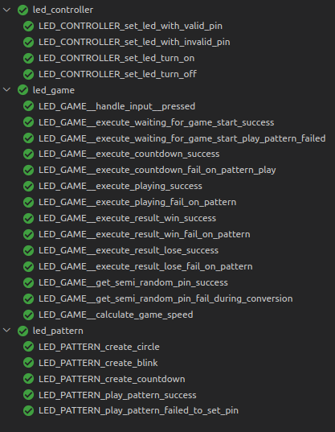

# CMAKE stm32F4 example 2022

**To build install:**

- cmake and make
- arm-none-eabi toolchain: https://xpack.github.io/blog/2020/07/03/arm-none-eabi-gcc-v9-3-1-1-1-released/
- make sure cmake,make,arm-none-eabi-gcc are reachable from path
- openocd 0.11.0 (https://github.com/openocd-org/openocd/tree/v0.11.0)

**Run: without vscode magic ;)**

1. `git submodule update --init`
2. `mkdir build && cd build`
3. `cmake ..`
4. `cmake --build . -- -j 16`
5. enjoy

**Run: With vscode magic**

1. To run and forget (execute the flash task)
2. To debug F5

Fallback source:
https://dev.to/younup/cmake-on-stm32-the-beginning-3766
https://github.com/ObKo/stm32-cmake

> If you want to use an older version of openocd (0.10.0) is the one you get by the ubuntu apt archives,
> Then you need to add a different override regex in your launch.json (https://github.com/Marus/cortex-debug/issues/166)

## Testing coverage

Made for the blogpost "Unlock Embedded Software Testing with Ceedling & VSCode"
Where we step by step guide you through the process of setting up the ceedling test framework and writing your first tests.

[Unlock Embedded Software Testing with Ceedling & VSCode](https://medium.com/@erbo-engineering/unlock-embedded-software-testing-with-ceedling-vscode-773657f2cf10)

